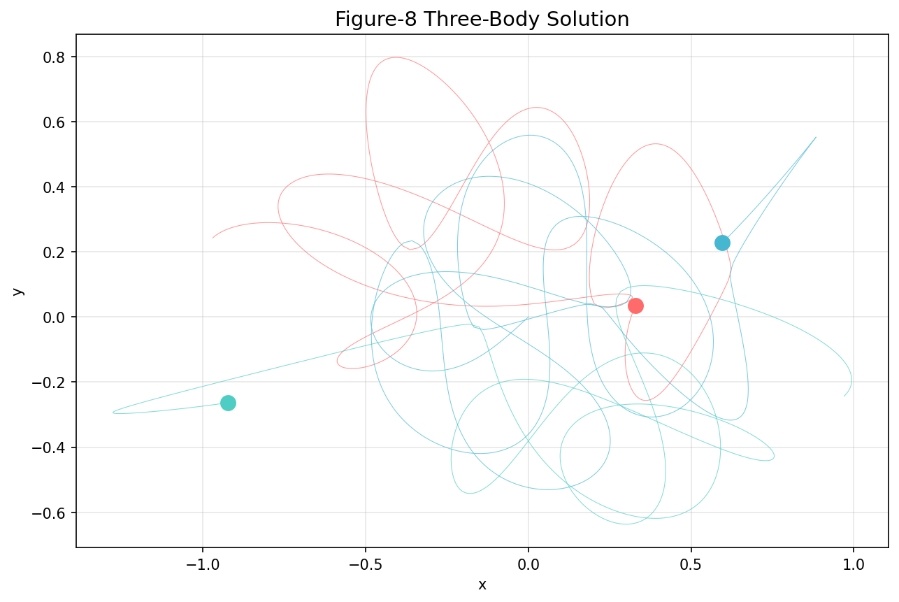

# 3-Body Problem

GPU-accelerated N-body gravitational simulation with audio-reactive visualization. Each body responds to a dedicated frequency band of the input audio, producing synchronized physics-driven music visualizations.



## How It Works

1. **Audio analysis** — 10-band frequency extraction with beat detection (librosa)
2. **Physics simulation** — N-body gravity with NVIDIA Warp GPU kernels, audio-modulated forces
3. **Rendering** — 360-degree starfield, HDR bloom, frequency-reactive trails, cinematic camera
4. **Export** — MP4 video with synchronized audio, HLS live streaming

## Features

- **Frequency-reactive bodies** — 10 bodies each mapped to a frequency band (sub-bass through treble), with size, glow, and trail visibility driven by band energy
- **GPU-accelerated physics** — NVIDIA Warp kernels for N-body gravitational computation, harmonic resonance, spectral spawning, and boundary control
- **Cinematic rendering** — Multiple camera modes (orbit, chase, overview), smooth transitions, intro sequences, advanced color palettes with zoned lighting
- **Audio analysis pipeline** — 10-band analyzer, harmonic analyzer, smoothed envelopes, frequency zone mapping
- **Chaos analysis** — Moment detection for identifying interesting simulation states

## Quick Start

```bash
python -m venv venv && source venv/bin/activate
pip install -r requirements.txt

# 30-second test render
python render_cinematic.py -r 1080p -q good --duration 30

# Full song render
python render_cinematic.py --audio path/to/song.mp3 -r 1080p -q good
```

Requires: Python 3.10+, NumPy, matplotlib, librosa, scipy. Optional: NVIDIA Warp (GPU acceleration).

## Project Structure

```
src/
  physics/         # Warp GPU kernels, N-body simulation, harmonic resonance
  audio/           # 10-band frequency analysis, beat detection, harmonic analysis
  rendering/       # Camera system, shader renderer, color palettes, intro sequences
  analysis/        # Moment detection, chaos metrics
  export/          # Clip generation, social media presets
  server/          # HLS live streaming server
tests/             # 9 test files covering physics, audio, rendering, analysis
docs/              # Physics foundations, architecture, GPU deployment guides
render_cinematic.py  # Main entry point
```

## Tech Stack

Python, NVIDIA Warp, NumPy, matplotlib, librosa, scipy, OpenGL

## Tests

```bash
python -m pytest tests/ -v
```

9 test files covering camera modes, frequency zones, harmonic analysis, physics engine, spectral spawning, and palette systems.

## Documentation

The `docs/` directory includes 17 files covering:
- Physics foundations (Lagrangian mechanics, potentials and fields, Aharonov-Bohm effect)
- Architecture reference and code guide
- NVIDIA Warp and OptiX integration guides
